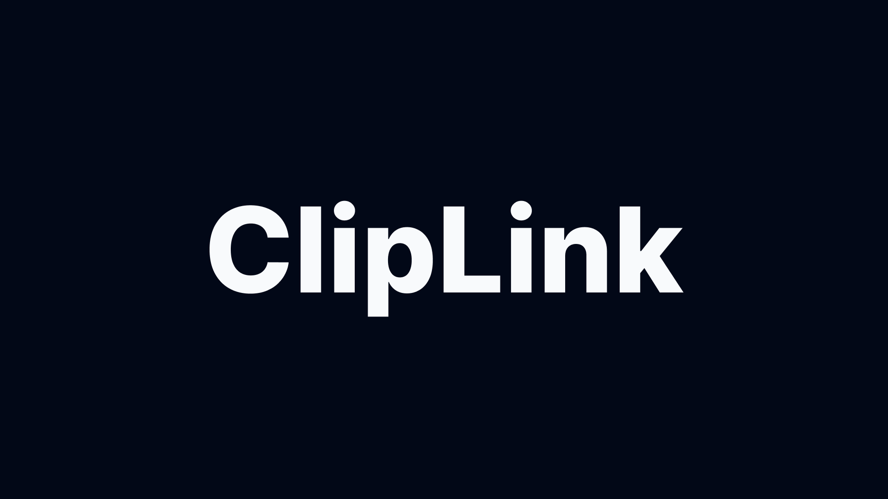

<a href="">
  
  <h1 align="center">ClipLink</h1>
</a>

<p align="center">
  An open-source Bitly like link reducer. 
</p>

<p align="center">
  <a href="#introduction"><strong>Introduction</strong></a> ·
  <a href="#setting-up-locally"><strong>Setting Up Locally</strong></a> ·
  <a href="#tech-stack"><strong>Tech Stack</strong></a>
</p>
<br/>

## Introduction

[ClipLink]() is a Bitly like link reducer.

<br />

## Setting Up Locally

To set up Cliplink locally, you'll need to clone the repository and set up the following environment variables:

- `VITE_TOKEN` – your Bitly API key (you can get one [here](https://bitly.com/a/sign_in?rd=/settings/api/))
- `VITE_GROUP` – your Bitly grou_guid (follow [the documentation](https://dev.bitly.com/docs/getting-started/introduction/))

To run the app locally, you can run the following commands:

```
pnpm i
pnpm build
pnpm dev
```

## Tech Stack

Cliplink is built on the following stack:

- [React](https://fr.react.dev/) - JavaScript Library
- [Vite](https://vitejs.dev/) - Build Tool
- [Tanstack Router](https://tanstack.com/router/v1) – Routing
- [Tanstack Query](https://tanstack.com/query/latest) - Query Management
- [Ky](https://github.com/sindresorhus/ky) - fetching Library
- [TailwindCSS](https://tailwindcss.com/) – CSS Framework
- [Shadcn/ui](https://ui.shadcn.com/) UI Components
- [React Use](https://github.com/streamich/react-use/tree/master) - Hooks Collection
- [Playwright](https://playwright.dev/) - e2e Testing
- [Canvas Confetti](https://www.kirilv.com/canvas-confetti/) - Animation canvas
- [React Hook Form](https://react-hook-form.com/) - Forms management
- [Zod](https://zod.dev/) - Schema validation

